# Modeltesting

Multi-model debate pipeline for analyzing a portfolio position against recent news using local Ollama models.

## What this does

The script runs a structured debate across specialist roles:

- **Analyst (`deepseek-r1:8b`)** opens with scenarios.
- **Contrarian (`mistral:7b`)** challenges assumptions and missed risks.
- **Quant (`qwen2.5:7b`)** verifies math and consistency.
- **Analyst rebuttal (`deepseek-r1:8b`)** updates views after feedback.
- **Final challenge + final quant check** close the debate.
- **Arbiter (`deepseek-r1:8b`)** produces one structured verdict.

## Debate Workflow Diagram




## Requirements

- Python 3.9+
- `requests` package
- Ollama running locally at `http://localhost:11434`
- Installed models:
  - `deepseek-r1:8b`
  - `mistral:7b`
  - `qwen2.5:7b`

Install Python dependency:

```bash
pip install requests
```

## Run

```bash
python test_models.py
```

## Output format

The script prints each round with:

- Role and model
- Runtime per round
- Full text response

At the end it prints:

- Total runtime
- Time breakdown by round
- Structured final signal from the arbiter

## Sample result

- Latest captured run: [Testing_Result.md](Testing_Result.md)

## File

- `test_models.py` — full debate orchestration script.

## Disclaimer

AI-generated analysis for experimentation only, not financial advice.